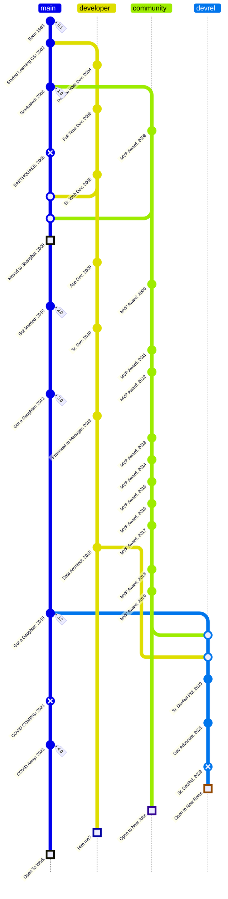

## 🤗 Welcome

This is a `mermaid` diagram to show my career journey:

```mermaid
gitGraph TB:
    commit id: "Born: 1983" tag: "0.1"
    commit id: "Started Learning CS: 2002"
    branch developer
    commit id: "Partime Web Dev: 2004"
    checkout main
    commit id: "Graduated: 2006" tag: "1.0"
    checkout developer
    commit id: "Full Time Dev: 2006"
    checkout main
    branch community
    checkout community
    commit id: "MVP Award: 2008"
    checkout main
    commit id: "EARTHQUAKE: 2008" type: REVERSE
    checkout developer
    commit id: "Sr. Web Dev: 2008"
    checkout main
    merge developer
    merge community
    commit id: "Moved to Shanghai: 2009" type: HIGHLIGHT
    checkout developer
    commit id: "App Dev: 2009"
    checkout community
    commit id: "MVP Award: 2009"
    checkout main
    commit id: "Got Married: 2010" tag: "2.0"
    checkout developer
    commit id: "Sr. Dev: 2010"
    checkout community
    commit id: "MVP Award: 2011"
    commit id: "MVP Award: 2012"
    checkout main
    commit id: "Got a Daughter: 2012" tag: "3.0"
    checkout developer
    commit id: "Promoted to Manager: 2013"
    checkout community
    commit id: "MVP Award: 2013"
    commit id: "MVP Award: 2014"
    commit id: "MVP Award: 2015"
    commit id: "MVP Award: 2016"
    commit id: "MVP Award: 2017"
    checkout developer
    commit id: "Data Architect: 2018"
    checkout community
    commit id: "MVP Award: 2018"
    commit id: "MVP Award: 2019"
    checkout main
    commit id: "Got a Daughter: 2019" tag: "3.2"
    branch devrel
    checkout devrel
    merge community
    merge developer
    commit id: "Sr. DevRel PM: 2019"
    checkout main
    commit id: "COVID COMING: 2021" type: REVERSE
    checkout devrel
    commit id: "Dev Advocate: 2021"
    checkout main
    commit id: "COVID Away: 2023" tag: "4.0"
    checkout devrel
    commit id: "Sr. DevRel: 2023" type: REVERSE
    commit id: "Open to New Roles" type: HIGHLIGHT
    checkout community
    commit id: "Open to New Jobs" type: HIGHLIGHT
    checkout developer
    commit id: "Hire me?" type: HIGHLIGHT
    checkout main
    commit id: "Open To Work" type: HIGHLIGHT
```

Find more on my [LinkedIn](https://www.linkedin.com/in/shinyzhu/) page.

